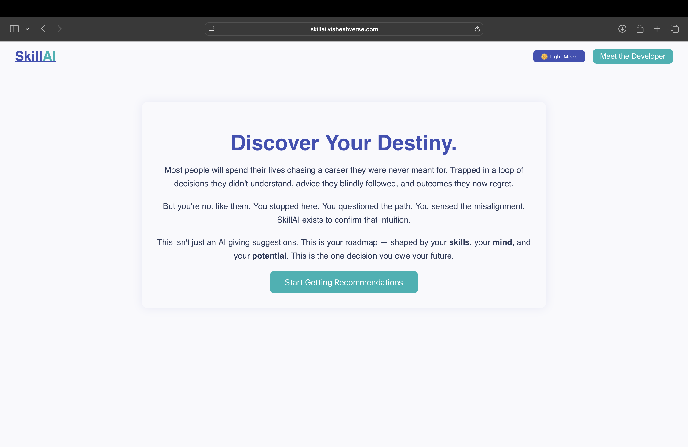
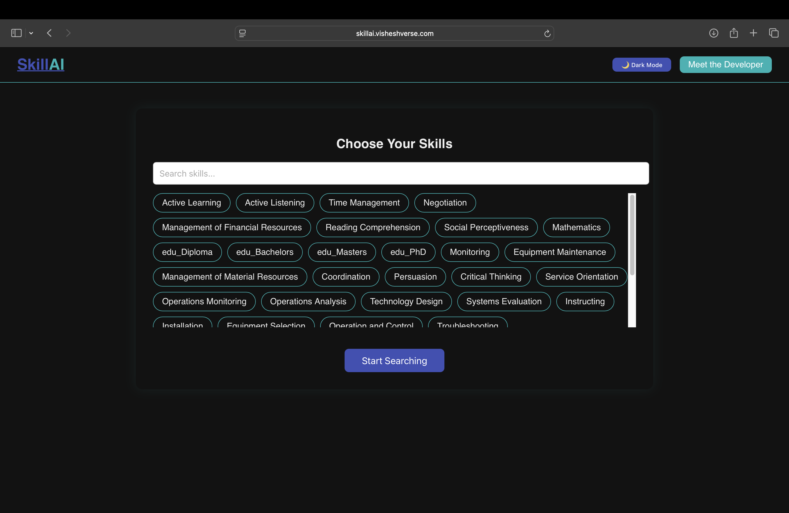
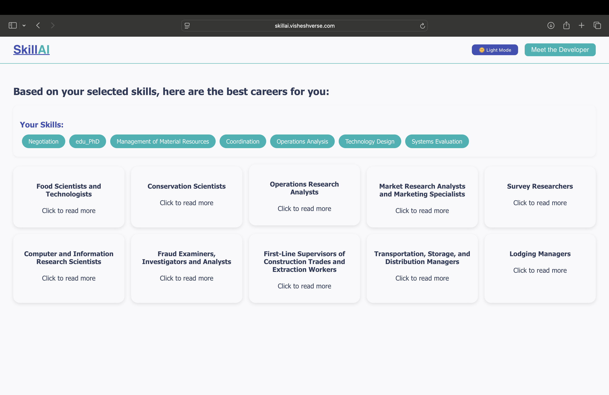

# <p align="center"></p>

# SkillAI –– Your Personalised Career Recommender Engine

---

## 📝 Brief Overview

SkillAI is an AI-assisted career recommendation engine designed to give a **career recommendation** suited to your particular skill set. It helps reduce **uncertainity** in your career choice and enables you to utilise your skills to the maximum potential. 

---

## 📸 Screenshots of the Web Demo

<p align="center">
    
    <br> <br>
    <em>Fig: Landing Page(Light Mode) on the Start of the Website</em>
</p>
<p align="center"> 
    
    <br> <br>
    <em>Fig: Skill Selection</em>
</p>
<p align="center"> 
    
    <br> <br>
    <em>Fig: Result Display</em>
</p>

---

## Tech Stack
<p align="center">
    
    
    
    
</p>

--- 

## Backend Walkthrough
- **Skill Selection :** Dynamically select selects as per your skill set from the frontend. 
- **Career Cluster Finding :** The XGBoost model deployed on the backend first selects suitable cluster. 
- **Career Picker :** DNN models specific to each cluster finds most suitable jobs from each cluster. 
- **Captum Explainer :** A Captum model derives the list of all the factors that contributed positively/negatively to prediction.
- **IBM WatsonX API :** Reads the Captum generated explanations and creates a detailed human readable report about why career was chosen.

--- 

## Folder Structure
```
SkillAI/
|–– assets/                         # Contains all images
|–– backend/
|   |–– cluster_specialisers/       # Contains all the cluster specialiser models
|   |–– cluster_label_encoder.pkl   # Label Encode for XGB Model
|   |–– cluster_model_xgb.pkl       # Model file of XGB Model
|   |–– index.js                    # Main server file for running the backend
|   |–– P1_cluster_specialiser.py   # Clusters the available dataset based on skills 
|   |–– P1_predict_career.py        # Predicts the most suitable careers by identifying clusters and then finding career
|   |–– P2_explain_careerCA.py      # Captum identifier to learn how model reached the conclusion
|   |–– P2_generate_reportCB.py     # Sends the data generated by the Captum to IBM WatsonX API to generate reports
|   |
|–– frontend/                       # ReactJS based frontend
|–– requirements.txt                # List of python libraries necessary to run the model
|–– Operation_brain/
|   |–– All trials at making the brain
|–– Preprocess/
|–– |–– P1_Get_Unique.py            # List of all the unique jobs in the dataset
|–– Logs.txt                        # My personal journey in making of this model
|–– venv/                           # Virtual Environment (should be created in root directory of project)
```

---

## Getting Started

### 🔧 Prerequisites
- Python v3.10 (No other version would be able to run the PyTorch properly)
- NodeJS v22.0.0+
- npm v10.0.0+

### 🖥️ Local Setup
#### Repository Cloning
``` bash
git clone https://github.com/Vishesh-Goyal7/SkillAI
cd SkillAI
```

#### Vitual Environment Setup
```bash
python3.10 -m venv venv  #(Do this in the)
source venv/bin/activate
pip install -r requirements.txt
```

#### Backend Setup
```bash
cd backend
npm install  

**Create a .env file with PORT=9123 and your IBM_API_KEY, IBM_SERVICE_URL and IBM_PROJECT_ID**

node index.js
```

#### Frontend Setup
```bash
cd ../frontend
npm install

**Create a .env file with REACT_APP_BACKEND_URL as http://localhost:9123**

npm start
```

---

## 📃 License

MIT License © 2025 Vishesh Goyal

---

## Live Demo 

[Live Demo](https://skillai.visheshverse.com)

## 🙋‍♂️ Author

**Vishesh Goyal**  
[GitHub](https://github.com/Vishesh-Goyal7) | [LinkedIn](https://linkedin.com/in/vishesh-goyal-2k5) | [Personal Portfolio](https://visheshverse.com)

---